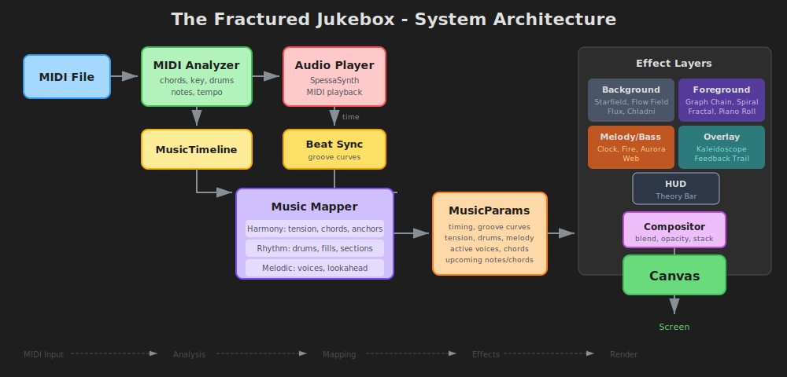

# The Fractured Jukebox

A layered music visualization system that transforms MIDI files into synchronized visual experiences.

## Using Claude Code

This project is set up for development with Claude Code. See `CLAUDE.md` for full context.

### Terminology

- **Effects**: Visual layers in `src/effects/` (e.g., `note-star.ts`, `flow-field.ts`)
- **Presets**: Curated effect combinations (`stars`, `clock`, `warp`, `fractal`, `chain`, `piano`)
- **Layers/Slots**: Effect slots by role — `bg`, `fg`, `overlay`, `melody`, `bass`, `hud`
- **Compositor**: Blends enabled effect layers with opacity and blend modes

## Feature Glossary

| Term | Description |
|------|-------------|
| **Presets** | |
| Stars | Default view with starfield, note particles spiraling inward, and bass fire effects |
| Clock | Rotating clock hands tracking melody and bass with theory bar display |
| Warp | Kaleidoscope overlay with Chladni wave patterns and spiral notes |
| Piano | Falling note visualization with on-screen piano keyboard |
| Fractal | Interactive fractal viewer with kaleidoscope post-processing |
| **Background Effects** | |
| Starfield | Animated stars with twinkling, nebula overlays, and parallax depth |
| Flow Field | Particle-based fluid simulation using Perlin noise |
| Chladni | Cymatics-inspired standing wave patterns |
| **Foreground Effects** | |
| Note Spiral | Active MIDI voices displayed on an expanding spiral |
| Note Star | Star particles spawning on note onsets, traveling inward |
| Piano Roll | Falling notes with lookahead and impact particles |
| Graph Chain | Force-directed graph of melody notes with harmonic connections |
| Fractal | Multi-type fractal renderer (Mandelbrot, Burning Ship, etc.) |
| **Overlays** | |
| Kaleidoscope | Mirror/fold effect with configurable segments |
| **Melody/Bass Layers** | |
| Melody Clock | Clock hand tracking melody pitch with compass physics |
| Bass Clock | Clock hand tracking chord root/harmonic center |
| Bass Fire | Flame particles responding to bass activity |
| Theory Bar | HUD showing current key, chord, and tension level |
| **Music Analysis** | |
| Tension | 0-1 value measuring harmonic dissonance and movement |
| Key Detection | Automatic identification of musical key from MIDI data |
| Chord Detection | Real-time chord recognition with roman numeral display |

### Structure

| Path | Purpose |
|------|---------|
| `src/main.ts` | App shell, render loop, UI |
| `src/effects/` | All visual effects |
| `src/state.ts` | URL encoding, presets, defaults |
| `docs/` | Feature docs, key-learnings.md |
| `research/` | Design rationale and theory |

### Key Docs

- `docs/key-learnings.md` — What works and what doesn't
- `docs/effects.md` — Effect interface and music params
- `docs/performance.md` — Profiling and optimization

## License

ISC License - see [LICENSE](LICENSE) for details.
