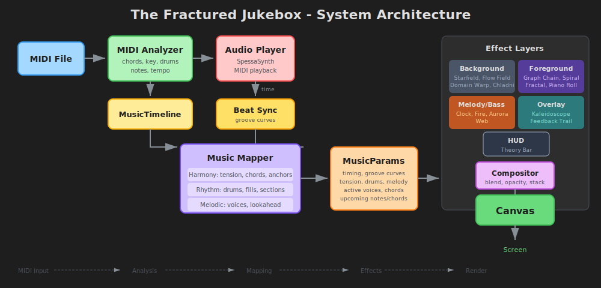

# The Fractured Jukebox

A layered music visualization system that transforms MIDI files into synchronized visual experiences.

## Using Claude Code

This project is set up for development with Claude Code. See `CLAUDE.md` for full context.

### Terminology

- **Effects**: Visual layers in `src/effects/` (e.g., `note-star.ts`, `flow-field.ts`)
- **Presets**: Curated effect combinations (`stars`, `clock`, `warp`, `fractal`, `chain`, `piano`)
- **Layers/Slots**: Effect slots by role — `bg`, `fg`, `overlay`, `melody`, `bass`, `hud`
- **Compositor**: Blends enabled effect layers with opacity and blend modes

### Structure

| Path | Purpose |
|------|---------|
| `src/main.ts` | App shell, render loop, UI |
| `src/effects/` | All visual effects |
| `src/state.ts` | URL encoding, presets, defaults |
| `docs/` | Feature docs, key-learnings.md |
| `research/` | Design rationale and theory |

### Key Docs

- `docs/key-learnings.md` — What works and what doesn't
- `docs/effects.md` — Effect interface and music params
- `docs/performance.md` — Profiling and optimization

## License

ISC License - see [LICENSE](LICENSE) for details.
